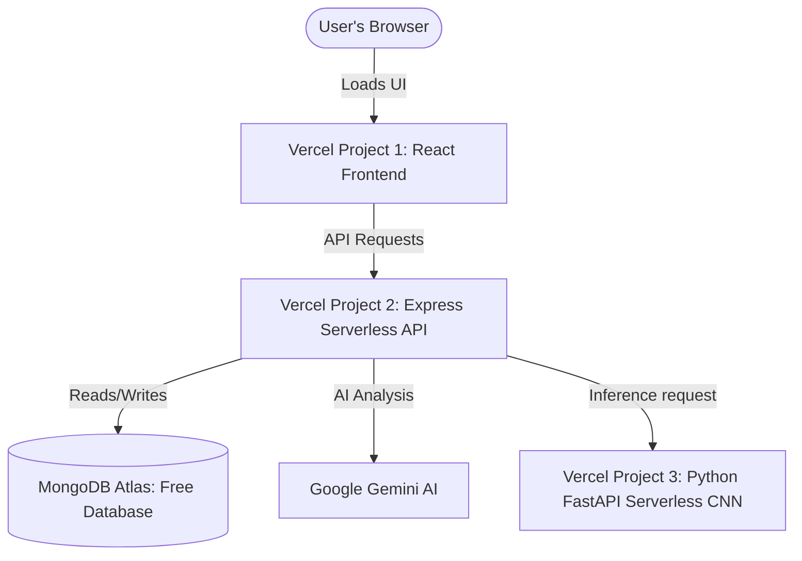

# FFDS All-Vercel Deployment Guide

This guide provides instructions for deploying the entire Food Freshness Detection System (FFDS) on **Vercel** for 100% free hosting with **no credit card required**.

---

## Deployment Architecture



### Why Vercel?
*   **Truly Free:** No credit card required.
*   **Simple Git Deploy:** Deploy directly from your GitHub repo.
*   **Fast Speeds:** Powered by global Edge Network.

*Note: Since TensorFlow is too large (500MB+) for Vercel's serverless function bundle limits (uncompressed limits), the CNN Service has been configured with an automatic mock predictor fallback mode when deployed to Vercel.*

---

## Step 1. MongoDB Atlas Setup (Free)

1. Go to [MongoDB Atlas](https://www.mongodb.com/cloud/atlas) and register a free account.
2. Select **M0 (Free)**.
3. In **Database Access**, create a user and save the password.
4. In **Network Access**, choose **Allow Access From Anywhere** (`0.0.0.0/0`).
5. Copy your connection string under **Connect** → **Drivers** (replace `<password>` with your database user password and suffix the path with `/ffds`):
   ```text
   mongodb+srv://<username>:<password>@<cluster>.mongodb.net/ffds?retryWrites=true&w=majority
   ```

---

## Step 2. Deploy CNN Service to Vercel

1. Log in to your [Vercel Dashboard](https://vercel.com).
2. Click **Add New** → **Project**.
3. Import your GitHub repository.
4. Configure the project:
   * **Project Name:** `ffds-cnn`
   * **Framework Preset:** `Other` (detected as Python)
   * **Root Directory:** Click Edit and select `backend/cnn-service`.
5. Click **Deploy**. Vercel will build the serverless functions in seconds.
6. Once deployed, copy your CNN URL (e.g. `https://ffds-cnn.vercel.app`).

---

## Step 3. Deploy Core API to Vercel

1. Go to your Vercel Dashboard.
2. Click **Add New** → **Project**.
3. Import your GitHub repository.
4. Configure the project:
   * **Project Name:** `ffds-api`
   * **Framework Preset:** `Other` (detected as Node.js)
   * **Root Directory:** Click Edit and select `backend/core-api`.
5. Under **Environment Variables**, add:
   * `PORT` = `5000`
   * `MONGODB_URI` = *(Your MongoDB Atlas connection string from Step 1)*
   * `JWT_SECRET` = *(A long random secret string)*
   * `GEMINI_API_KEY` = *(Your Gemini API key)*
   * `CNN_SERVICE_URL` = `https://ffds-cnn.vercel.app` (The CNN service URL from Step 2 - no trailing slash)
6. Click **Deploy**.
7. Once deployed, copy your API URL (e.g. `https://ffds-api.vercel.app`).

---

## Step 4. Deploy Frontend to Vercel

1. Go to your Vercel Dashboard.
2. Click **Add New** → **Project**.
3. Import your GitHub repository.
4. Configure the project:
   * **Project Name:** `ffds-frontend`
   * **Framework Preset:** `Vite` (detected automatically)
   * **Root Directory:** Click Edit and select `frontend`.
5. Under **Environment Variables**, add:
   * `VITE_API_BASE_URL` = `https://ffds-api.vercel.app` (The API URL from Step 3 - no trailing slash)
6. Click **Deploy**.
7. Copy your deployed web app URL (e.g. `https://ffds-frontend.vercel.app`).

---

## Step 5. Configure Production CORS Security (Optional)

To secure your API backend:
1. Go to your `ffds-api` project in Vercel settings.
2. Under **Environment Variables**, add:
   * `CORS_ORIGIN` = `https://ffds-frontend.vercel.app` (your frontend URL)
3. Redeploy or save to automatically restrict API access to only your frontend.
