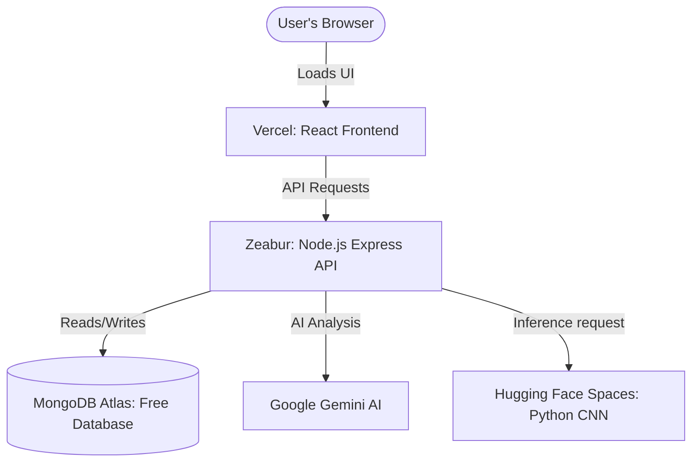

# FFDS No-Credit-Card Deployment Guide

This guide provides step-by-step instructions to deploy the entire Food Freshness Detection System (FFDS) using **100% free hosting tiers that do not require entering credit card details**.

---

## Architecture Overview



| Service | Platform | Cost | Credit Card Needed? |
|---|---|---|---|
| **Frontend** | [Vercel](https://vercel.com) | Free | **No** |
| **Core API** | [Zeabur](https://zeabur.com) | Free | **No** |
| **CNN Service** | [Hugging Face Spaces](https://huggingface.co/spaces) | Free (16GB RAM) | **No** |
| **Database** | [MongoDB Atlas](https://mongodb.com/cloud) | Free (M0 Tier) | **No** |

---

## Step 1. Setup MongoDB Atlas (Free)

1. Go to [MongoDB Atlas](https://www.mongodb.com/cloud/atlas) and sign up for a free account (no credit card required).
2. Create a new database deployment and select **M0 (Free)**.
3. In **Database Access**, create a user (e.g., username `srila`, password `yourpassword`).
4. In **Network Access**, click **Add IP Address** and choose **Allow Access From Anywhere** (`0.0.0.0/0`).
5. Click **Connect** → **Drivers** and copy your connection string:
   ```text
   mongodb+srv://<username>:<password>@<cluster>.mongodb.net/ffds?retryWrites=true&w=majority
   ```
   *(Replace `<username>` and `<password>` with your database user credentials. Save this string for Step 3).*

---

## Step 2. Deploy CNN Service to Hugging Face Spaces

Hugging Face Spaces allows you to run complete Docker containers for free with up to 16GB of RAM, making it perfect for hosting Python ML models.

1. Create a free account on [Hugging Face](https://huggingface.co/).
2. Click on your profile picture in the top-right corner and select **New Space**.
3. Configure the Space:
   * **Space Name:** `ffds-cnn`
   * **SDK:** Select **Docker**
   * **Docker Template:** Choose **Blank**
   * **Space License:** `mit` (or any open license)
   * **Visibility:** **Public** (required for the free API to be reached by the backend)
4. Click **Create Space**.
5. Clone your space repository locally, or upload the contents of the `backend/cnn-service` folder directly:
   * To upload via git:
     ```bash
     # Navigate to the cnn-service folder
     cd backend/cnn-service
     
     # Initialize Git (if not already done)
     git init
     
     # Add the Hugging Face Space remote (found on the Space's page)
     git remote add hf https://huggingface.co/spaces/YOUR_USERNAME/ffds-cnn
     
     # Force push the cnn-service files to the space
     git add .
     git commit -m "Deploy to HF Space"
     git push -u hf main --force
     ```
6. The space will automatically build and run the `Dockerfile` we created. Once running, your CNN service URL will be:
   ```text
   https://YOUR_USERNAME-ffds-cnn.hf.space
   ```
   Verify it by opening `https://YOUR_USERNAME-ffds-cnn.hf.space/health` in your browser. It should show:
   ```json
   {"status":"ok","model_loaded":true}
   ```

---

## Step 3. Deploy Core API to Zeabur

Zeabur allows deploying Node.js apps straight from GitHub without requiring a credit card.

1. Sign up on [Zeabur](https://zeabur.com) using your GitHub account.
2. Click **Create Project** and select a region closest to you.
3. Click **Deploy New Service** and select **GitHub**.
4. Authorize Zeabur to access your repository and choose your project.
5. In the config options:
   * Set **Root Directory** to `backend/core-api`.
6. Once the service is created, go to the **Variables** tab of the service and add:
   * `PORT` = `5000`
   * `MONGODB_URI` = *(Your MongoDB Atlas connection string from Step 1)*
   * `JWT_SECRET` = *(Any long secure random string)*
   * `GEMINI_API_KEY` = *(Your Gemini API key)*
   * `CNN_SERVICE_URL` = `https://YOUR_USERNAME-ffds-cnn.hf.space` (from Step 2 - no trailing slash)
7. Under the **Domain** tab of your service, click **Generate Domain** or choose a custom subdomain (e.g., `ffds-api.zeabur.app`).
8. Copy the generated domain (e.g., `https://ffds-api.zeabur.app`).

---

## Step 4. Deploy Frontend to Vercel

1. Log in to [Vercel](https://vercel.com) using your GitHub account (no card required).
2. Click **Add New** → **Project**.
3. Import your GitHub repository.
4. Configure the project:
   * Set the **Root Directory** to `frontend`.
5. Under **Environment Variables**, add:
   * `VITE_API_BASE_URL` = `https://ffds-api.zeabur.app/api` (the Zeabur Core API URL + `/api`)
6. Click **Deploy**.
7. Once deployed, copy your frontend domain (e.g. `https://ffds-frontend.vercel.app`).

---

## Step 5. Restrict CORS on Zeabur Core API (Optional but Recommended)

For production security, restrict access to your Core API so only your Vercel frontend can call it:

1. Go to your Zeabur dashboard.
2. Under the **Variables** tab of your Core API service, add a new variable:
   * `CORS_ORIGIN` = `https://ffds-frontend.vercel.app` (replace with your actual Vercel domain)
3. Save the variable. Zeabur will automatically redeploy the service with the restricted CORS rules.
